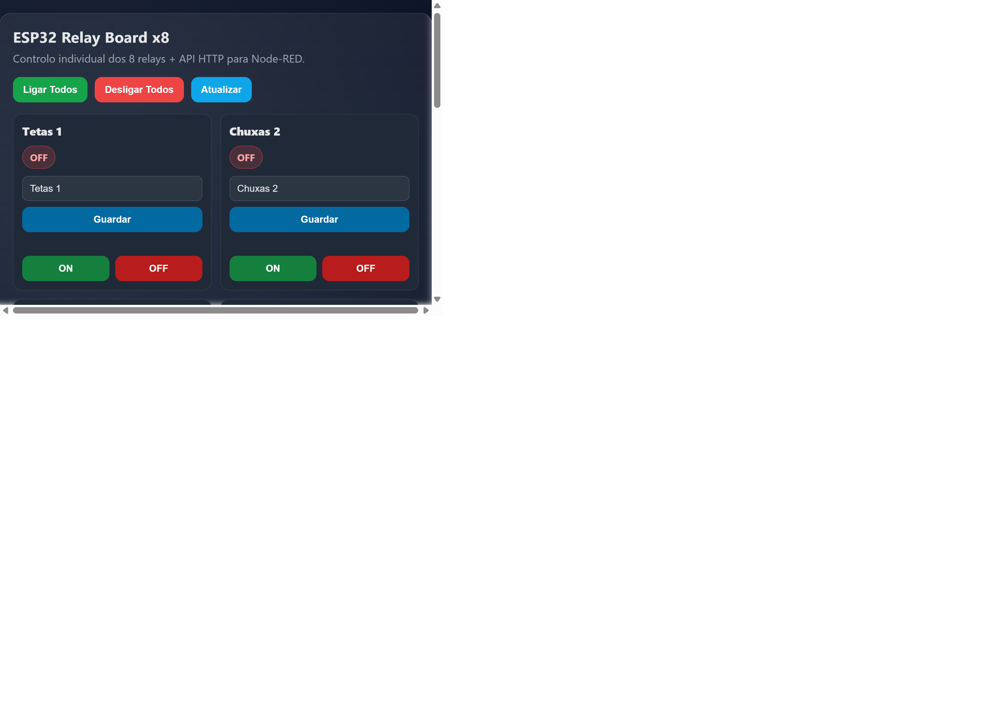
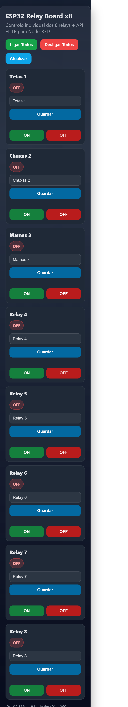

# ESP32 Relay Board x8

ESP32 firmware for the 8-relay ESP32-WROOM-32E board with OTA updates, a built-in web UI, and ready-to-import Node-RED flows.

## Features

- OTA updates with ArduinoOTA
- Web UI for individual relay ON/OFF control
- Editable relay names stored in ESP32 internal flash
- HTTP API for Node-RED or other clients
- Bulk ON/OFF commands
- VS Code task for OTA deployment
- Example Node-RED flow with command confirmation

## Files

- `esp32_relay_ota_webui.ino`: main firmware
- `.vscode/tasks.json`: VS Code OTA task
- `tools/ota_upload_retry.ps1`: OTA upload helper with retry
- `node-red/esp32-relay-confirmacao-flow.json`: full Node-RED flow with confirmation
- `node-red/esp32-relay-http-flow.json`: basic Node-RED flow

## Relay GPIO map

This project uses the board mapping from the eMariete article:

1. Relay 1 -> GPIO32
2. Relay 2 -> GPIO33
3. Relay 3 -> GPIO25
4. Relay 4 -> GPIO26
5. Relay 5 -> GPIO27
6. Relay 6 -> GPIO14
7. Relay 7 -> GPIO12
8. Relay 8 -> GPIO13

## Local configuration

Do not put real credentials in tracked files.

1. Copy `local_secrets.example.h` to `local_secrets.h`
2. Copy `platformio.local.example.ini` to `platformio.local.ini`
3. Fill in your Wi-Fi and OTA values in those local files

`local_secrets.h` is used by the firmware.

`platformio.local.ini` is used only for local OTA upload settings and is ignored by git.

## First upload

1. Configure `local_secrets.h`
2. Upload once via USB-TTL or serial
3. Open Serial Monitor at 115200 and note the assigned IP
4. Open `http://ESP32_IP/` in a browser

## OTA upload

You can use either:

- VS Code task: `ESP32: OTA Upload 192.168.1.181`
- PowerShell script: `tools/ota_upload_retry.ps1 -Ip 192.168.1.181 -Retries 3`

## Web UI

The web UI provides:

- ON/OFF buttons for each relay
- Buttons to switch all relays ON or OFF
- Editable relay names with persistent storage
- Status refresh and uptime display

### Screenshots

Desktop:

Mobile:

## HTTP API

### Get all states and names

- `GET /api/status`

Example:

- `http://192.168.1.181/api/status`

### Set one relay

- `GET /api/relay?ch=1&state=1`
- `GET /api/relay?ch=1&state=0`

Accepted state values:

- `1`, `0`, `on`, `off`, `true`, `false`

### Set all relays

- `GET /api/all?state=1`
- `GET /api/all?state=0`

### Save relay name

- `GET /api/name?ch=1&name=Sala`

### Alternative path-based commands

- `GET /api/relay/1/on`
- `GET /api/relay/1/off`
- `GET /api/all/on`
- `GET /api/all/off`

## Node-RED

Import one of the flows from the `node-red` folder.

Recommended flow:

- `node-red/esp32-relay-confirmacao-flow.json`

Before importing, replace the ESP32 IP in the flow if needed.

## Notes

- Relay names are stored in ESP32 flash using `Preferences`
- This board uses active-HIGH relay logic
- OTA requires the same password in firmware and local PlatformIO config
